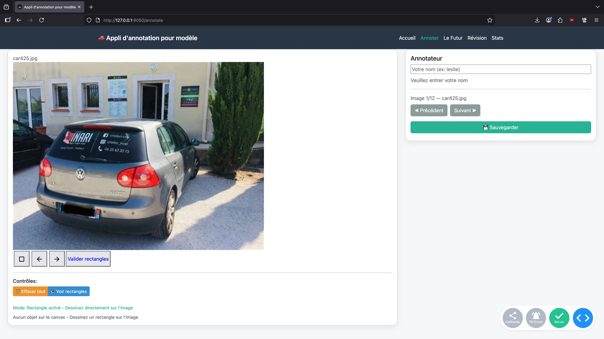

**🚗 Appli d'annotation pour modèles de détection de voitures**

Projet complet d'annotation d'images pour l'entraînement et l'évaluation de modèles de détection de voitures.

**✨ Présentation**

Cette application web permet d'annoter, de visualiser et d'analyser des images de voitures pour créer des jeux de données adaptés à l'entraînement de modèles de détection automatique. Elle propose une interface moderne, des outils d'annotation avancés, et des statistiques détaillées.

**🖥️ Aperçu**

**🚀 Installation rapide**

- Cloner le dépôt
- Installer les dépendances (pip install -r requirements.txt)
- Lancer l'application
- Accéder à l'interface Ouvrez http://localhost:8050 dans votre navigateur.

**🗂️ Structure du projet**

🛠️ Fonctionnalités principales

    Annotation d'images (bounding boxes, classes, etc.)
    Navigation multi-pages (Accueil, Annotation, Statistiques, Review, Futur)
    Export COCO pour l'entraînement de modèles
    Statistiques avancées sur les annotations
    Interface responsive (Dash + Bootstrap)
    Support du cache pour accélérer l'expérience

📄 Exemples d'utilisation

    Afficher une image d'exemple
    Annoter une image
    Rendez-vous sur la page "Annotation" de l'application
    Sélectionnez une image, dessinez les bounding boxes, sauvegardez
    Exporter les annotations au format COCO
    Utilisez la page "Export" ou le script export_coco.py

📊 Pages principales

    Accueil : Présentation et navigation
    Annotation : Outils d'annotation d'images
    Review : Relecture et correction des annotations
    Statistiques : Visualisation des stats sur les annotations
    Le Futur : Modèle d'IA capable de détecter les modèles de voitures et les plaques
